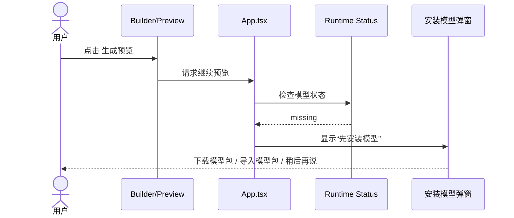
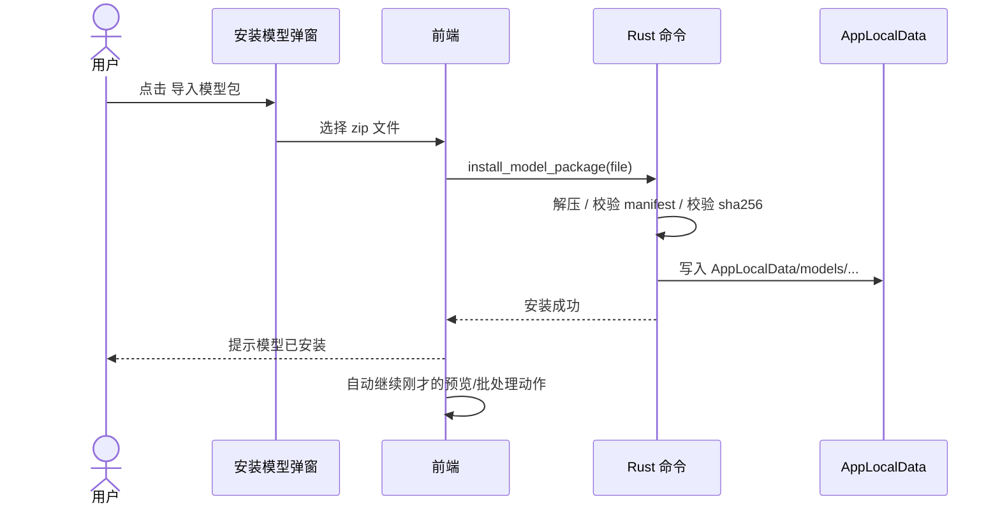
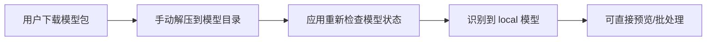

# 模型包分发方案

## 目标

解决当前安装包过大的问题，同时保留这几个产品原则：

- 默认安装包尽可能小
- 不强依赖应用内联网下载
- 用户可以手动下载模型包后导入
- 高级用户可以直接把模型文件放到指定目录
- 应用升级和模型升级解耦

这份方案的核心结论是：

`瘦应用 + 独立模型包 + 手动导入为主 + 本地模型目录优先`

---

## 当前现状

当前模型通过 Tauri bundle resources 一起打进安装包。

当前实现特征：

- 模型资源目录约定在 `resources/models/`
- 打包时映射到 `$RESOURCES/models/`
- 运行时主要从 bundled models 目录中发现模型

相关代码：

- `resources/models/README.md`
- `src-tauri/tauri.conf.json`
- `src-tauri/src/model_runtime.rs`

当前问题：

1. 安装包体积大
2. 更新模型需要跟着重发应用
3. 用户无法独立管理模型
4. 后续做多模型或版本切换会越来越重

---

## 方案结论

推荐采用下面这条路线：

1. 应用安装包默认不再包含大模型
2. 模型单独发布为 zip 包
3. 用户从模型下载页或其他镜像地址下载模型包
4. 应用支持：
   - 导入模型包
   - 打开模型目录
   - 检查当前模型状态
5. 运行时优先从本地可写目录查找模型
6. 找不到时再提示用户安装模型

这不是“应用自动下载模型”的方案，而是“应用支持安装外部模型包”的方案。

---

## 为什么不继续用 bundled resources

官方 Tauri 文档给出的限制很明确：

- Linux：`$RESOURCES` 不可写
- macOS：`$RESOURCES` 不可写
- Windows 某些安装模式下写 `$RESOURCES` 可能需要管理员权限

因此：

- 不应该让用户去替换应用包内部的资源目录
- 不应该把“模型安装”设计成修改 `$RESOURCES`

更合理的模型安装位置应该是：

- `AppLocalData`
- 或 `AppData`

参考：

- Tauri File System plugin 文档  
  https://v2.tauri.app/plugin/file-system/
- Tauri JS FS API 参考  
  https://v2.tauri.app/reference/javascript/fs/

---

## 推荐目录结构

### 1. 本地模型目录

建议统一使用：

```text
<AppLocalData>/models/
  lama-v1/
    1.0.0/
      manifest.json
      model.onnx
      sha256.txt
```

优点：

- 同一个 profile 可以存多个版本
- 版本切换容易
- 删除旧版本容易
- 与 bundled resources 完全解耦

### 2. 模型包结构

建议用户下载的 zip 包内部就是：

```text
lama-v1-1.0.0.zip
  manifest.json
  model.onnx
  sha256.txt
```

也可以接受：

```text
lama-v1-1.0.0.zip
  lama-v1/
    manifest.json
    model.onnx
    sha256.txt
```

但更推荐平铺结构，因为导入逻辑更简单。

---

## manifest 设计

建议把 `manifest.json` 扩展成下面结构：

```json
{
  "profile_id": "lama-v1",
  "display_name": "智能修复模型",
  "version": "1.0.0",
  "model_file": "model.onnx",
  "input_width": 512,
  "input_height": 512,
  "sha256": "8b7f...",
  "min_app_version": "0.1.1"
}
```

字段说明：

- `profile_id`: 模型类型标识
- `display_name`: 用户可见名称
- `version`: 模型版本
- `model_file`: 主模型文件名
- `input_width` / `input_height`: 推理输入尺寸
- `sha256`: 完整性校验
- `min_app_version`: 最低支持应用版本

---

## 运行时查找顺序

当前 `model_runtime.rs` 是从 bundled models 中发现模型。

建议改成：

1. 先查 `AppLocalData/models/`
2. 再查 bundled `resources/models/`
3. 都没有则视为 `未安装模型`

建议新建统一入口，例如：

```rust
resolve_model_installations(app)
resolve_preferred_model(app)
```

返回内容至少包含：

- `source`: `"local"` | `"bundled"` | `"missing"`
- `profile_id`
- `version`
- `model_path`
- `display_name`

这样以后 UI 可以明确告诉用户：

- 当前已安装模型
- 当前用的是本地模型还是内置模型

---

## 用户流程

## 流程 1：首次点击预览，模型未安装



### 交互原则

- 不自动开始网络下载
- 不让用户理解“ONNX / 资源目录 / 缺失”
- 直接说明：
  - `需要先安装智能修复模型`
  - `模型只需安装一次`

---

## 流程 2：用户手动下载后导入模型包



---

## 流程 3：高级用户手动放入模型目录



应用里需要提供：

- `打开模型目录`
- `重新检查模型`

---

## 前端状态机

建议把模型状态扩展成面向用户的状态，而不只是“加载中 / 加载失败”。

### 建议状态

```text
missing       未安装
installing    安装中（导入/解压/校验）
ready         已可用
loading       模型预热中
failed        安装或加载失败
```

### 建议展示文案

| 状态 | 文案 |
|------|------|
| `missing` | 需要先安装智能修复模型 |
| `installing` | 正在安装模型，请稍候 |
| `ready` | 智能修复模型已就绪 |
| `loading` | 正在准备智能修复引擎 |
| `failed` | 模型安装或加载失败 |

---

## UI 方案

### 1. 首页模型状态条

现有 `ModelStatusIndicator` 可以演进成：

- `已就绪`
- `未安装`
- `安装中`
- `失败`

在 `未安装` 时按钮改成：

- `下载模型包`
- `导入模型包`

### 2. 预览/批处理前的阻断弹窗

标题：

`先安装智能修复模型`

说明：

`默认安装包不包含大模型。安装一次后，就可以一直使用智能修复预览和批量处理。`

按钮：

- `下载模型包`
- `导入模型包`
- `稍后再说`

### 3. 设置页增加模型管理区

建议新增一个区块：

- 当前模型：已安装 / 未安装
- 版本：`1.0.0`
- 来源：本地安装 / 应用内置
- 按钮：
  - `下载模型包`
  - `导入模型包`
  - `打开模型目录`
  - `删除旧模型`

---

## Rust 命令设计

建议新增这些命令：

### 查询类

- `get_model_installation_status`
- `list_installed_models`
- `get_model_install_dir`

### 操作类

- `install_model_package(file_path: String)`
- `open_model_install_dir`
- `remove_installed_model(profile_id: String, version: String)`

### 安装逻辑

`install_model_package` 需要完成：

1. 解压 zip 到临时目录
2. 读取并校验 `manifest.json`
3. 检查 `min_app_version`
4. 校验 `model.onnx` 的 `sha256`
5. 移动到 `AppLocalData/models/<profile>/<version>/`
6. 刷新当前模型状态

---

## 权限与依赖

如果要支持“导入模型包后由应用解压安装”，Rust 侧就足够，不一定需要前端 FS 插件。

如果要支持前端直接浏览/写入 AppData，则需要：

- Tauri FS plugin
- 对 `AppLocalData` 的读写 scope

参考：

- File System 插件支持 `AppData` / `AppLocalData` 目录读写权限
- 官方文档明确可以为这些目录配置读写 scope

来源：

- https://v2.tauri.app/plugin/file-system/
- https://v2.tauri.app/reference/javascript/fs/

---

## 发布策略

建议把应用和模型彻底拆开发布。

### 应用发布物

- `BatchImageStudio-mac.dmg`
- `BatchImageStudio-win.exe`
- `BatchImageStudio-linux.AppImage`

### 模型发布物

- `batch-image-studio-model-lama-v1-1.0.0.zip`

模型发布地址可以有多个：

- GitHub Releases
- 官网下载页
- 国内镜像
- 网盘备用地址

应用里只需要跳转到统一下载页，不强依赖单一源。

---

## 分阶段实施计划

## Phase 1：运行时支持本地模型目录

目标：

- 应用能够从 `AppLocalData/models` 读取模型
- 保留 bundled fallback
- 不改 UI 主流程

产出：

- `model_runtime.rs` 查找顺序调整
- 新的模型状态结构

## Phase 2：支持导入模型包

目标：

- 应用支持用户导入 zip 模型包
- 安装到本地模型目录
- 校验成功后可直接用

产出：

- 新 Rust 安装命令
- 新模型状态 UI
- 缺失模型阻断弹窗

## Phase 3：正式移除首包内置模型

目标：

- 默认安装包不再携带大模型
- 应用完全依赖本地已安装模型

产出：

- `tauri.conf.json` 不再映射大模型资源
- 发布流程拆分成 app + model package

---

## 风险与应对

### 风险 1：用户下载错模型包

应对：

- 校验 `profile_id`
- 校验 `min_app_version`
- UI 明确显示“这个模型包不适用于当前版本”

### 风险 2：zip 损坏或文件不完整

应对：

- 校验 `sha256`
- 安装失败后不覆盖现有模型

### 风险 3：用户不会导入

应对：

- 弹窗里给两条路径：
  - `下载模型包`
  - `导入模型包`
- 设置页里长期保留“模型管理”

### 风险 4：多版本模型占空间

应对：

- 设置页提供“删除旧模型”
- 默认只使用最新兼容版本

### 风险 5：以后想回到自动下载

应对：

- 当前目录结构和状态机已兼容
- 后续只需再加一个“下载到本地模型目录”的实现

---

## 不做的事

当前这版方案明确不做：

- 首次启动强制联网下载模型
- 让用户手动替换应用包内部资源
- 多模型在线市场
- 模型热更新平台

---

## 最终建议

先按下面顺序推进：

1. 让运行时支持 `AppLocalData/models`
2. 做“模型未安装”状态
3. 做“导入模型包 / 打开模型目录”
4. 最后移除首包内置模型

这样能最稳地把“大安装包”问题拆掉，同时不把小白用户扔进复杂的自动下载流程里。

---

## 参考

- Tauri File System plugin  
  https://v2.tauri.app/plugin/file-system/
- Tauri JS FS API  
  https://v2.tauri.app/reference/javascript/fs/
- Tauri Plugin Permissions  
  https://v2.tauri.app/learn/security/using-plugin-permissions/

