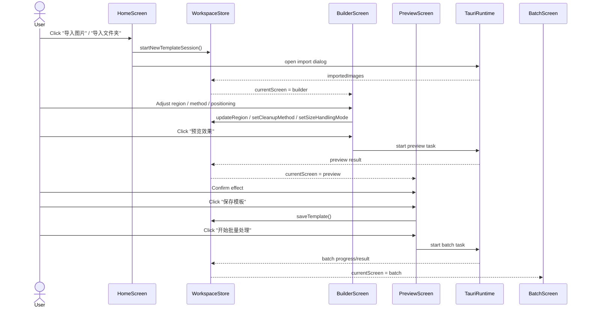
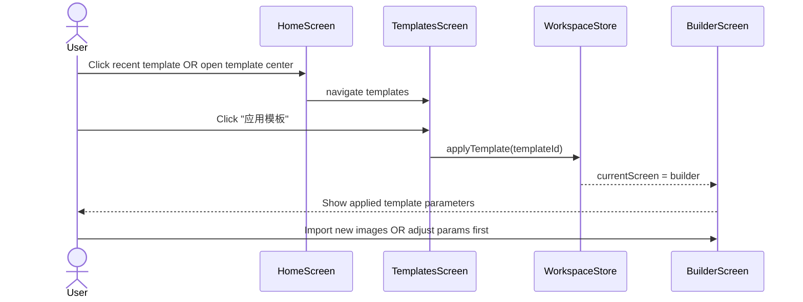
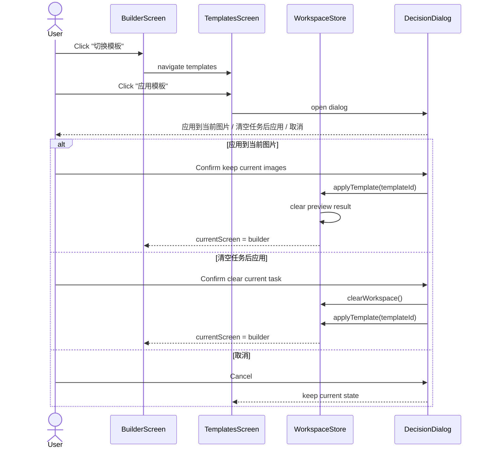
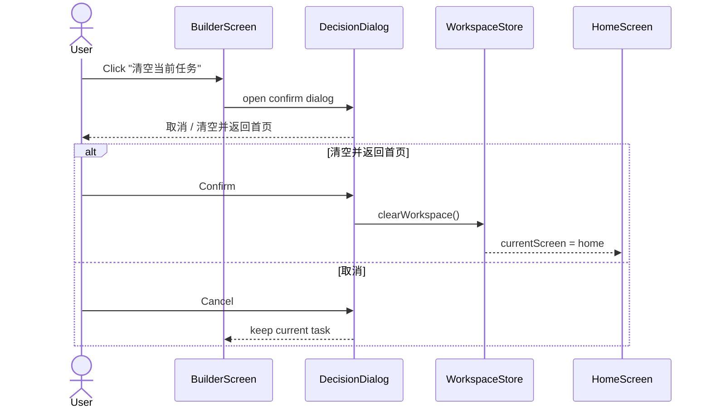
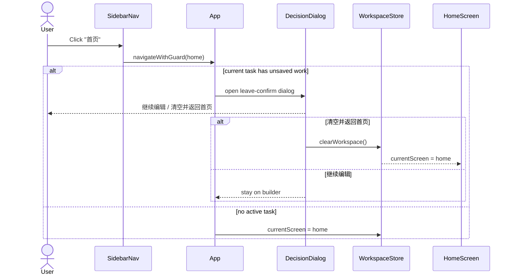
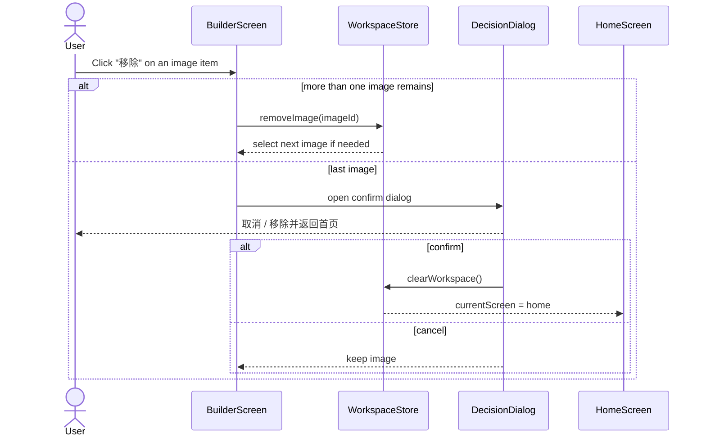
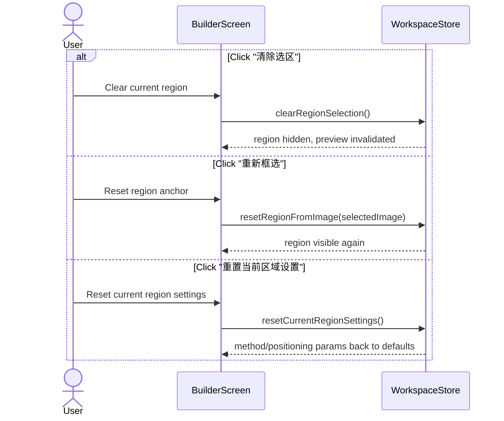
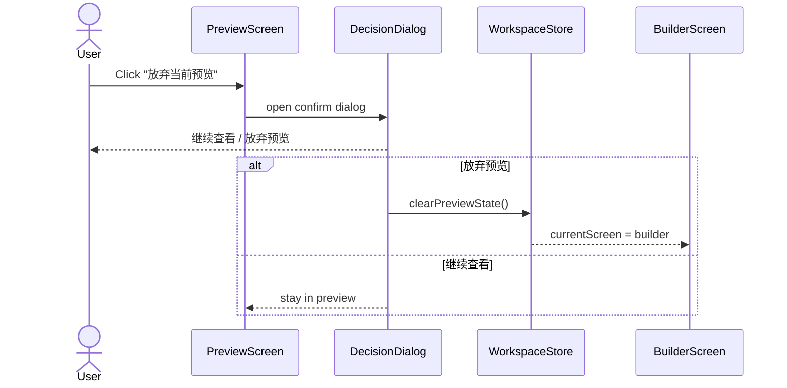
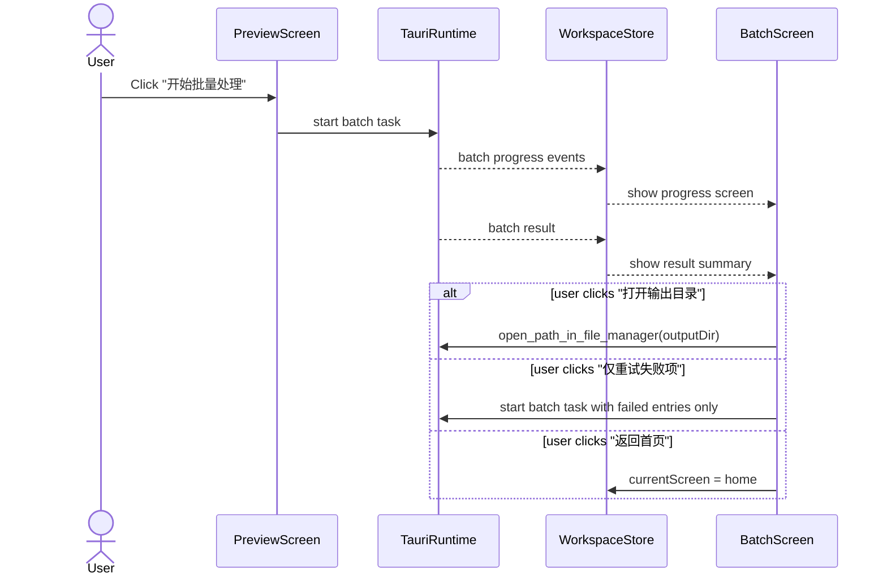

# Workflow Sequence Diagrams

**Goal:** Use explicit sequence diagrams to govern workflow changes before more UI/logic tweaks are made.

**Rule:** When a workflow bug is found, update the relevant sequence first, then update code and tests.

---

## Why This Matters

The current project is no longer blocked on page skeletons. The main risk now is **workflow drift**:

* a button exists but leads to the wrong page
* a destructive action clears too much or too little state
* a template switch behaves differently depending on where it is triggered
* import actions mix up “replace current task” and “append to current task”
* preview/batch actions are enabled in states where they should not be

These are all **sequence problems**, not just component problems.

---

## Core Entities

Use these mental entities consistently when discussing flows:

* `User`
* `HomeScreen`
* `BuilderScreen`
* `PreviewScreen`
* `BatchScreen`
* `TemplatesScreen`
* `HistoryScreen`
* `WorkspaceStore`
* `TauriRuntime`

---

## Global Invariants

These invariants should remain true across all flows:

1. `builder` is the canonical place to inspect or change template parameters.
2. `preview` is only for effect confirmation, not heavy editing.
3. `batch` is only for execution monitoring and post-run actions.
4. Destructive actions must explicitly state what will be cleared.
5. When a task is cleared, the app returns to `home`.
6. Applying a template must not silently create inconsistent state.
7. Any action unavailable in browser preview must fail with a clear notification, not silent no-op or crash.

---

## Flow 1: First-Time User Main Flow

### Current Expected UX

* This flow should be the cleanest path.
* No confirmation dialog is needed unless the user tries to leave with unsaved work.

---

## Flow 2: Template-First Reuse Flow

### Current Decision

This is the preferred default behavior for template application.

**Do not** jump straight into a file picker as the primary path.

---

## Flow 3: Switch Template During Active Task

### Risk Area

This is currently one of the most fragile workflows because it mixes:

* current imported images
* current preview result
* current template edit state
* navigation to another page

Every future template-application bug should be checked against this sequence first.

---

## Flow 4: Clear Task and Return Home

### Invariant

This action must clear:

* imported images
* preview result
* current unsaved edit state
* current task context

It should **not** delete saved templates or history.

---

## Flow 5: Leave Builder via Sidebar/Home

### Note

This is not the same as “just navigate”.

Navigation from `builder` is a guarded state transition.

---

## Flow 6: Remove Single Image

### UX Requirement

Single-image removal must be visibly available in the image list itself, not only through “当前图片” context.

---

## Flow 7: Region Recovery Controls

### Important Distinction

* `清除选区` = remove active selection
* `重新框选` = create a fresh region again
* `重置当前区域设置` = keep region, reset method/positioning-related settings

These three must never collapse into one ambiguous action.

---

## Flow 8: Discard Preview

### Invariant

Discarding preview clears only:

* preview result
* batch result summary derived from that preview path

It does **not** clear:

* imported images
* region selection
* template parameters

---

## Flow 9: Batch Completion and Follow-Up Actions

---

## Current High-Risk Sequence Gaps

These are the places most likely to produce future bugs:

1. **Import semantics are still mixed**
   - “start new task” vs “append images to current task” are not yet formally separated

2. **Template switching still depends on page-hopping**
   - visible now, but not yet a dedicated in-place switch flow

3. **Preview sample list reuses builder list semantics**
   - currently safe, but the underlying list is still builder-oriented

4. **Batch cancellation/pause semantics are still thin**
   - present conceptually, not yet modeled with the same rigor as task clearing

---

## Recommended Next Fix Order

1. Split import behavior into:
   * `replace_current_task`
   * `append_to_current_task`
2. Move template switching into a more direct current-task flow
3. Separate preview image list behavior from builder image list behavior
4. Formalize batch cancellation / interruption / completion follow-up sequences

---

## Working Rule Going Forward

Before changing workflow code:

1. Identify which sequence this bug belongs to
2. Update the diagram first
3. Update code
4. Update tests

If the bug does not fit any sequence, add a new one before coding.
