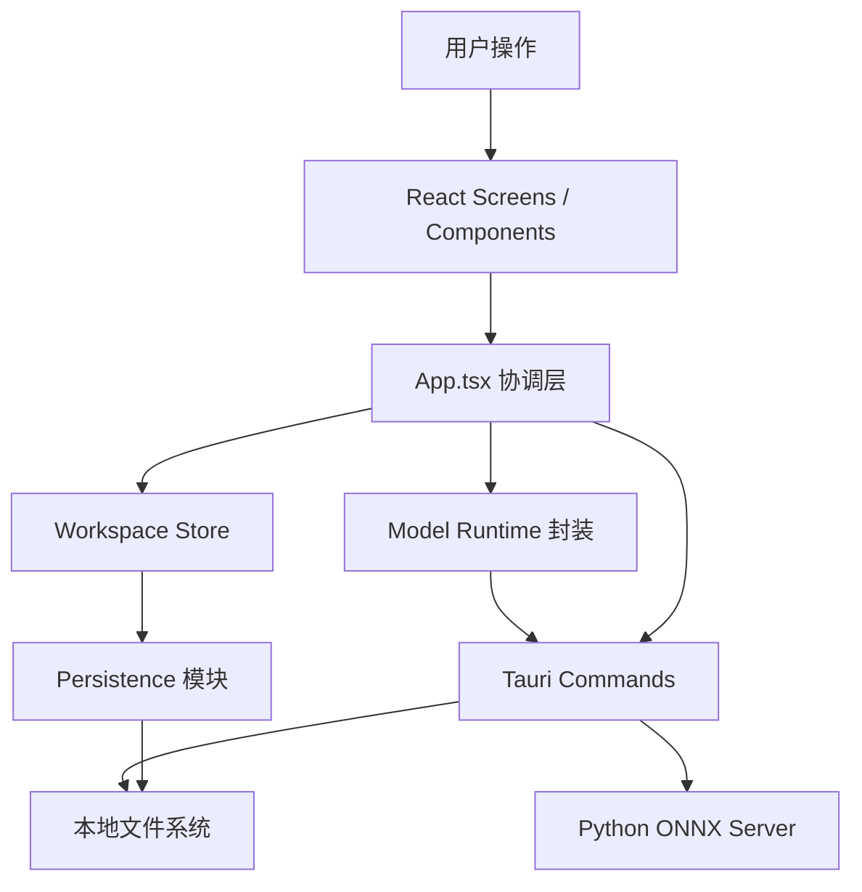
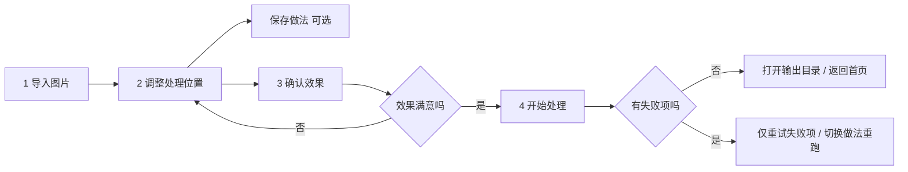
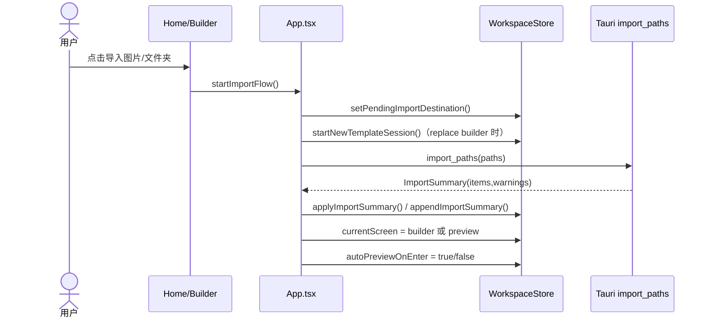
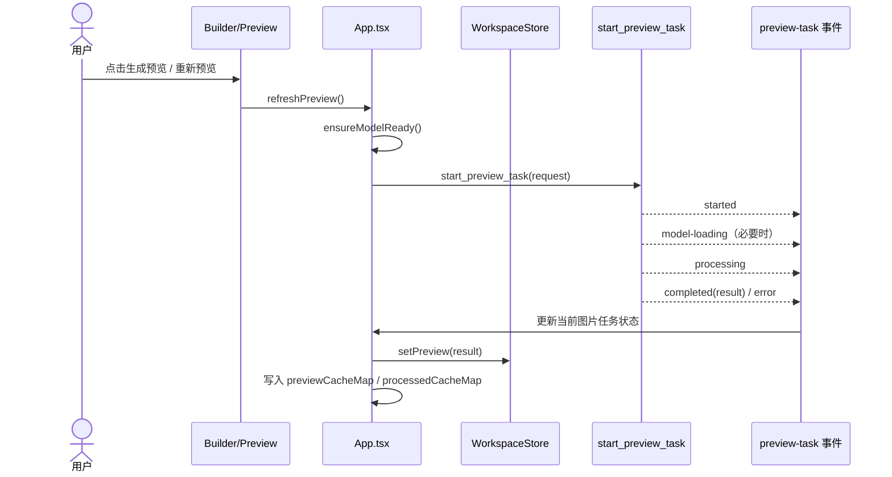
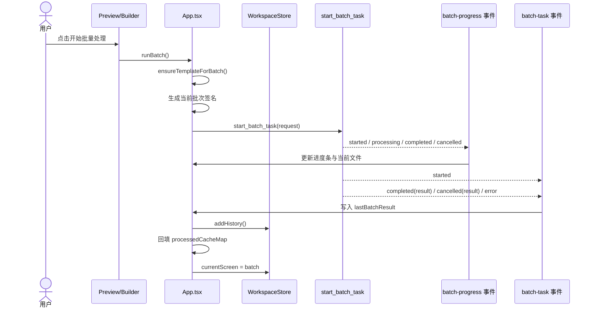
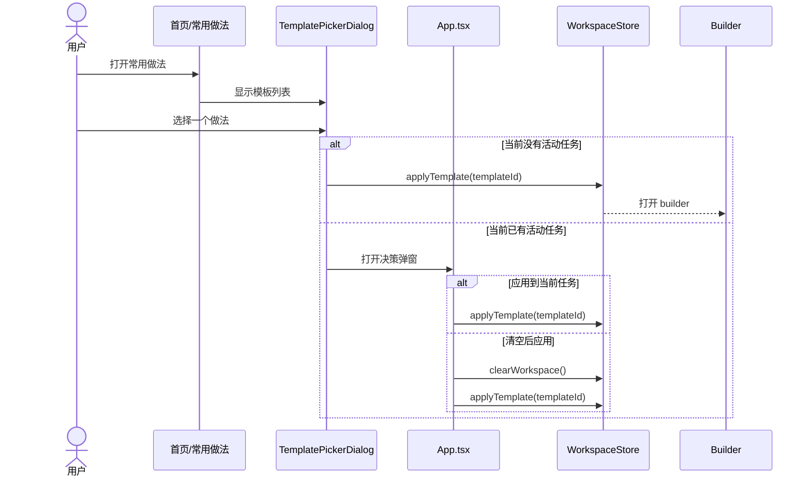

# 当前系统总览与流程图

这份文档描述当前代码库里的真实工作方式，重点回答 4 个问题：

1. 用户主流程现在是什么
2. 前端、状态层、Tauri 后端分别负责什么
3. 预览和批处理的时序如何流转
4. 后续改交互或流程时，哪些约束不能破

适用对象：

- 继续维护当前项目的开发者
- 需要快速理解现状的产品或设计同学
- 在修流程问题前，需要先确认调用链的人

---

## 产品主线

当前产品定位已经收敛为：

`导入图片 -> 调整处理位置 -> 确认效果 -> 开始批量处理`

它不是通用修图器，而是一个本地优先、模板驱动的局部批量清理工具。

---

## 页面职责

| 页面 | 当前职责 | 不应该承担的职责 |
|------|----------|------------------|
| 首页 `home` | 进入任务、导入图片、快速套用常用做法 | 深度编辑 |
| 调整处理位置 `builder` | 选样图、框区域、选处理方式、保存做法 | 执行批处理监控 |
| 确认效果 `preview` | 看样图效果、重新预览、决定是否批量处理 | 复杂参数编辑 |
| 开始处理 `batch` | 看进度、结果、失败项、重试失败项 | 修改模板参数 |
| 常用做法 `templates` | 管理和套用模板 | 导入图片 |
| 处理记录 `history` | 查看历史处理结果并复用模板 | 编辑当前任务 |
| 默认设置 `settings` | 保存少量默认项 | 承担主流程入口 |

---

## 架构分层

---

## 核心模块

### 1. React 界面层

负责：

- 呈现主流程页面
- 渲染按钮、提示、对话框
- 承接拖拽、点击、键盘等用户输入

主要入口：

- `src/App.tsx`
- `src/screens/*`
- `src/components/*`

### 2. App 协调层

`src/App.tsx` 负责把页面、全局状态和 Tauri 事件串起来。它当前承担：

- 屏幕切换
- 导入触发
- 预览任务启动
- 批处理启动
- Tauri 事件监听
- 弹窗和通知协调

可以把它理解成当前应用的流程编排层。

### 3. Workspace Store

`src/store/workspace.ts` 是全局业务状态中心，负责：

- 当前页面状态
- 当前任务里的图片、区域、参数
- 当前模板与历史记录
- 模型加载状态
- 通知状态

它现在不再直接处理 `localStorage` 细节，也不再动态导入 Tauri API。

### 4. Persistence 模块

`src/store/persistence.ts` 负责：

- 模板、历史、设置的本地持久化
- 模板预览图的轻量化清洗
- 启动时的持久化数据修正

它的目标是把“状态长什么样”和“怎么存进去”分开。

### 5. Model Runtime 模块

`src/lib/modelRuntime.ts` 负责：

- 预加载模型
- 查询模型状态

这个模块只是前端对 Tauri 模型命令的轻封装，方便 App 和 Store 解耦。

### 6. Tauri 命令层

`src-tauri/src/lib.rs` 暴露的关键命令包括：

- `bootstrap_state`
- `preload_model`
- `get_model_status`
- `import_paths`
- `start_preview_task`
- `start_batch_task`
- `preview_cleanup`
- `preview_mask`
- `open_path_in_file_manager`
- `cancel_batch_task`

### 7. Python ONNX Server

ONNX 模型由 Rust 通过常驻 Python 进程调用。

当前好处：

- 避免每次任务都重新加载模型
- 保持桌面端本地推理能力
- 兼容现有模型和推理脚本

---

## 用户主流程图

---

## 导入流程时序图

### 说明

- `replace` 会清理当前任务上下文
- `append` 会保留当前任务并追加图片
- 导入结果里的图片已经包含缩略图、尺寸、格式、文件大小

---

## 预览生成时序图

### 说明

- 预览结果会写入两层缓存：
  - `previewCacheMap`：完整预览展示结果
  - `processedCacheMap`：批处理可复用的处理结果路径
- 当前图片切换时，如果命中缓存，可以直接回填预览，不重复生成

---

## 批处理时序图

### 说明

- 批处理会复用当前参数签名命中的缓存
- 如果缓存格式与目标输出格式一致，会直接复制缓存文件
- 否则会重新编码输出
- 失败项可单独重试

---

## 模板优先复用流程

---

## 关键状态约束

这些约束是后续改流程时必须保持的：

1. `builder` 是唯一可以稳定修改区域和处理参数的页面。
2. `preview` 只负责确认效果，不承载复杂编辑。
3. `batch` 只负责执行反馈、失败处理和输出入口。
4. 清空任务不会删除已保存模板或历史记录。
5. 模板切换不能静默破坏当前任务状态。
6. 浏览器预览环境里，所有桌面端专属动作必须给出明确提示，不能静默失败。
7. 批处理复用缓存时，必须只复用当前参数签名命中的结果。

---

## 当前状态持久化内容

持久化到前端本地存储的内容：

- 模板列表
- 历史记录
- 默认设置

不会持久化的运行期状态：

- 当前导入图片任务
- 当前选中图片
- 当前预览结果
- 当前批处理进度
- 临时事件状态

---

## 桌面端与浏览器预览的差异

浏览器预览模式仅用于界面验证，不具备完整桌面能力。

浏览器模式下受限的行为包括：

- 系统文件选择器
- 系统目录打开
- 真实 ONNX 模型加载
- 真实批处理执行

因此：

- UI 可以演示流程
- 真正的导入、预览、批量处理需要在 Tauri 桌面环境验证

---

## 关键文件索引

### 前端

- `src/App.tsx`
- `src/store/workspace.ts`
- `src/store/persistence.ts`
- `src/lib/modelRuntime.ts`
- `src/screens/HomeScreen.tsx`
- `src/screens/TemplateBuilderScreen.tsx`
- `src/screens/PreviewScreen.tsx`
- `src/screens/BatchScreen.tsx`

### 后端

- `src-tauri/src/lib.rs`
- `src-tauri/src/model_runtime.rs`
- `src-tauri/src/onnx_server.rs`
- `src-tauri/scripts/lama_server.py`

---

## 建议维护方式

如果后续再改流程，建议优先更新这份文档中的对应 Mermaid 图，再改代码。

尤其是这几类问题：

- 导入 replace/append 规则变化
- 模板切换覆盖当前任务
- 预览与批处理按钮启用条件变化
- 失败重试逻辑变化
- 模型加载与后台事件时序变化

